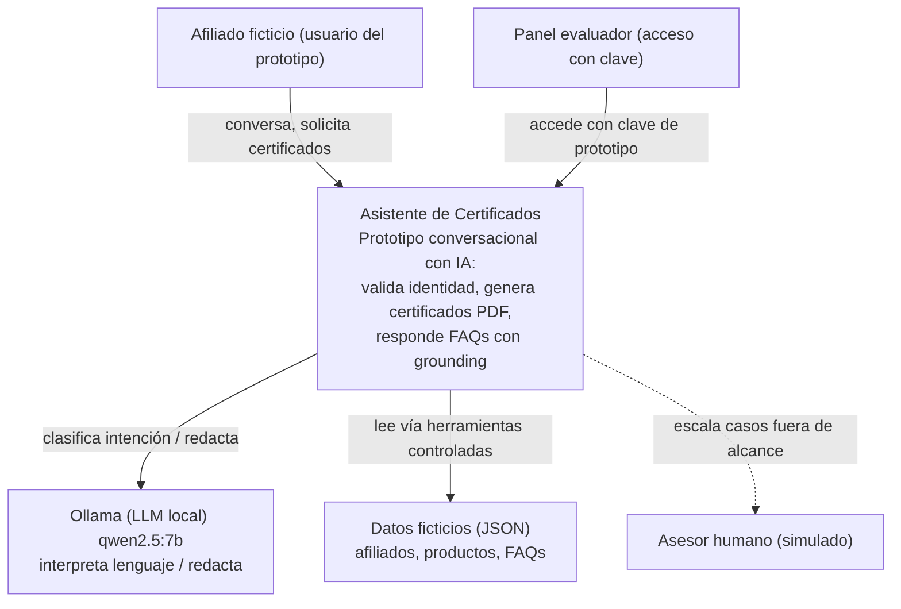
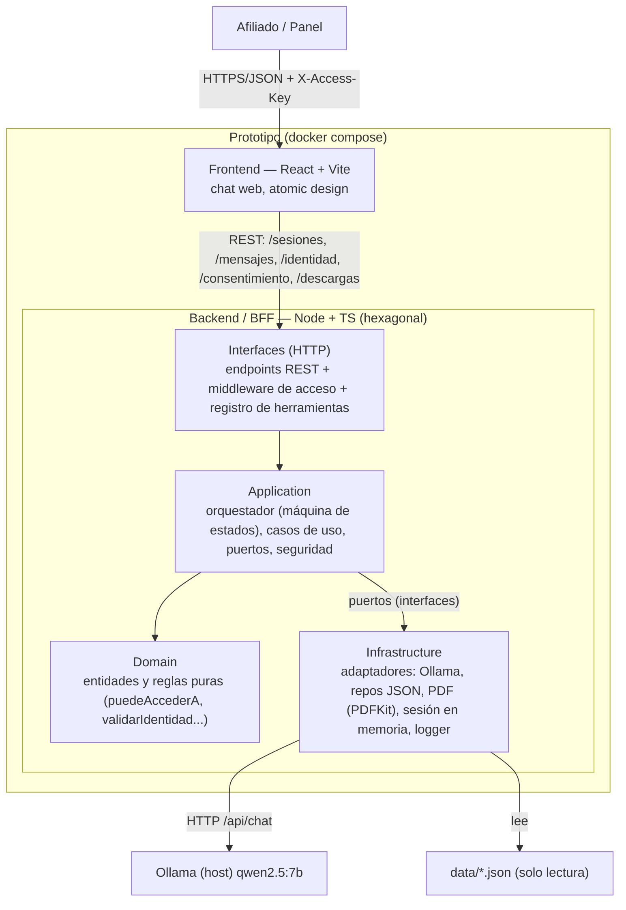

# Diagramas C4 — Niveles 1 y 2

Diagramas en Mermaid (versionables). Renderizan en GitHub y en editores compatibles.

## Nivel 1 — Contexto

**Nota clave:** el LLM no accede a los datos directamente; el sistema lee la fuente a través de
herramientas con validación y autorización por sesión.

## Nivel 2 — Contenedores

**Dirección de dependencias:** hacia adentro. El dominio no conoce Ollama ni Express; cambiar de
proveedor de LLM o de fuente de datos es cambiar un adaptador de infraestructura.
